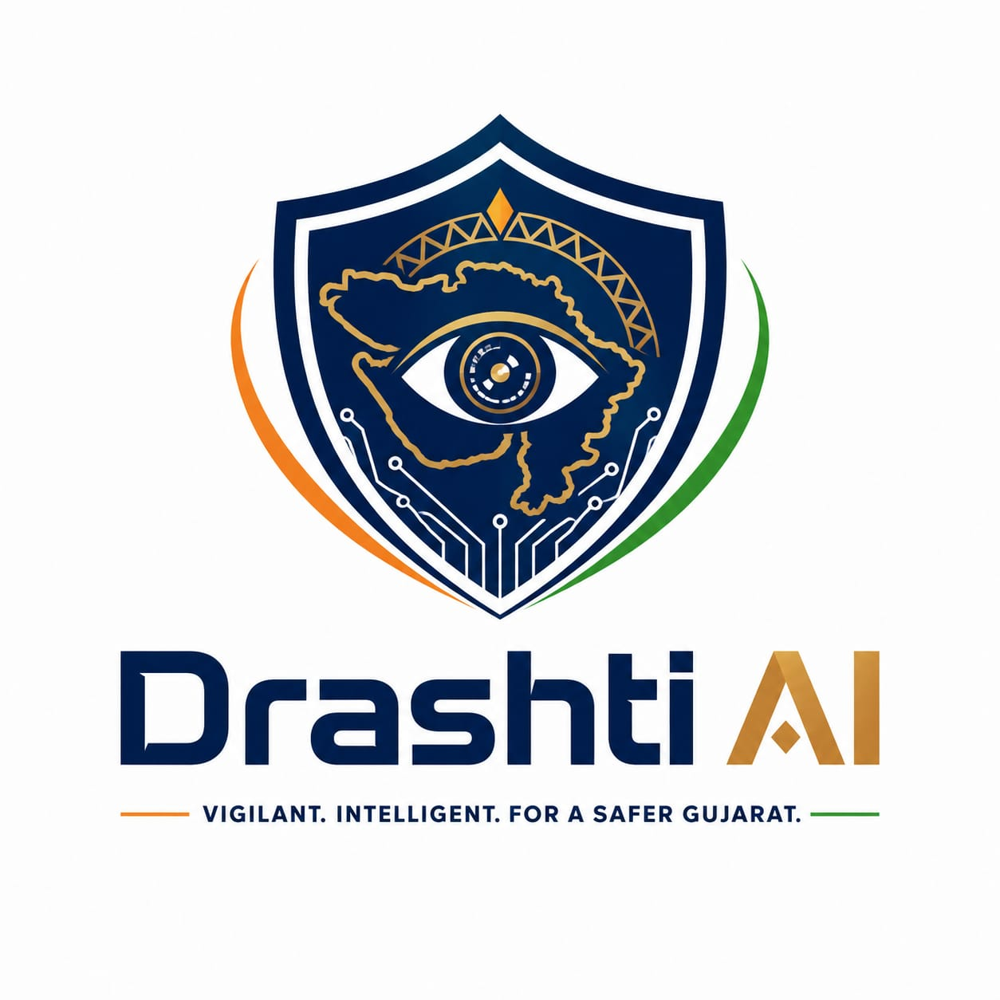

<div align="center">

# 👁️ Drashti AI

**Federated Edge Intelligence Platform for Unified CCTV Analytics and Smart Policing**

*VIGILANT. INTELLIGENT. FOR A SAFER BHARAT.*

[](https://drashti-ai.devs.surf/)
[](https://fastapi.tiangolo.com/)
[](https://react.dev/)
[](https://www.postgresql.org/)
[](https://www.docker.com/)

> *"Integrate existing infrastructure ➔ Process at the edge ➔ Correlate centrally ➔ Act in real time."*

🔗 **Deployed Application:** [https://drashti-ai.devs.surf/](https://drashti-ai.devs.surf/)

---

[Overview](#-overview) • [Live Deployment](#-live-deployment) • [Key Capabilities](#-key-capabilities) • [Architecture](#-architecture) • [Tech Stack](#-tech-stack) • [Repository Layout](#-repository-layout) • [Quick Start](#-quick-start) • [Module Documentation](#-module-documentation) • [Engineering Guardrails](#-engineering-guardrails) • [Roadmap](#-roadmap)

</div>

---

## 📋 Table of Contents

- [🌐 Live Deployment](#-live-deployment)
- [🌟 Overview](#-overview)
- [✨ Current Delivery & Core Modules](#-current-delivery--core-modules)
  - [Operational Modules (P0.1 - P0.4)](#operational-modules-p01---p04)
  - [Advanced Intelligence Workspaces](#advanced-intelligence-workspaces)
  - [Control Plane & Architecture Philosophy](#control-plane--architecture-philosophy)
- [🏗️ Architecture Position](#️-architecture-position)
- [🛠️ Tech Stack](#️-tech-stack)
- [📁 Repository Layout](#-repository-layout)
- [🚀 Quick Start & Installation](#-quick-start--installation)
  - [Option A: Local Development (Without Docker)](#option-a-local-development-without-docker)
  - [Option B: Containerized Production (With Docker & PostGIS)](#option-b-containerized-production-with-docker--postgis)
- [📚 Module Documentation](#-module-documentation)
- [🛡️ Engineering Guardrails](#️-engineering-guardrails)
- [🗺️ Project Roadmap](#-roadmap)

---

## 🌐 Live Deployment

The system is deployed and accessible live at:

👉 **[https://drashti-ai.devs.surf/](https://drashti-ai.devs.surf/)**

---

## 🌟 Overview

**Drashti AI** is a vendor-neutral integration layer for Gujarat's heterogeneous government CCTV estate. It is engineered to preserve existing departmental VMS (Video Management System) investments, process video streams near their source at the edge, and correlate security-relevant events centrally in real time.

By avoiding single-vendor lock-in, **Drashti AI** seamlessly connects multi-departmental video feeds into a unified statewide smart policing and CCTV analytics ecosystem.

---

## ✨ Current Delivery & Core Modules

The current release provides a complete connected camera-to-investigation pipeline supported by four advanced operational modules:

### Operational Modules (P0.1 - P0.4)

| Module ID | Module Name | Scope & Key Capabilities | Status |
| :--- | :--- | :--- | :---: |
| **P0.1** | **Camera Registry** | Department & camera onboarding (manual & CSV), normalized non-secret metadata, lifecycle/heartbeat/health handling, statistics, audit history, and location-aware registry APIs. | `Complete` |
| **P0.2** | **GIS Operations** | Statewide command-centre workspace, dedicated GIS view, API-backed filtering/search, health markers with shape/glyph cues, and viewport clustering using real GeoJSON data. | `Baseline` |
| **P0.3** | **Stream Federation** | Encrypted write-only connection profiles, 6 protocol adapter manifests, SSRF-aware endpoint admission, bounded server probes, normalized verification evidence, and redacted audit logs. | `Baseline` |
| **P0.3R** | **Media Runtime** | Supervised FFmpeg sessions for RTSP, HLS, MJPEG, and file profiles; bounded same-origin HLS playback; freshness watchdogs; capped retry/backoff; capacity admission; telemetry & controls. | `Baseline` |
| **P0.4** | **Video Stream Processing** | Independent raw-frame sessions, latest-frame bounded buffers, frame-age rejection, per-camera FPS control, failure isolation, reconnect supervision, AI batch contracts, and Live Operations wall. | `Baseline` |
| **SIE** | **Special Investigation Engine** | Immutable ANPR events, target search, confusion-aware plate correlation, temporal feasibility checks, auditable case state, route inference, next-camera ranking, and map-first workspace. | `Baseline` |
| **ReID** | **Vehicle Re-Identification** | Provider-neutral quality-gated observation ingestion, bounded multi-signal ranking, physical feasibility rejection, manual audited review, and confirmed-match pursuit recalculation. | `Baseline` |
| **Cases** | **Cases & Evidence** | Authorized case files, assignment filtering, controlled source links, canonical SHA-256 manifests, redacted retrieval references, activity history, and structured exports. | `Baseline` |
| **Health** | **Camera Health & Maintenance**| Stream/edge/heartbeat aggregates, deterministic states, debounced grouped incidents, auto-recovery, per-camera history, and explainable rule-based maintenance findings. | `Baseline` |
| **Coverage**| **Coverage Intelligence** | Registry/health counts, temporary and permanent location-based gaps, critical nodes, candidate deployment areas, persisted assumptions, and non-mutating outage simulation. | `Baseline` |

---

### Advanced Intelligence Workspaces

* **AI Intelligence Workspace (`#/ai`)**: Exposes real searchable vehicle crops, dedicated `.pt` plate localization, Google-primary / Groq-fallback OCR evidence, provider decisions, review boundaries, model provenance, and live queue state.
* **Visual Intelligence Workspace (`#/visual`)**: Exposes Groq-enriched appearance & condition profiles with camera, date, time, plate-visibility, image-quality, and damage filters.
* **Alerts Engine (`#/alerts`)**: Accepted live OCR events are matched against the API-backed watchlist to produce idempotent, reviewable alerts.

---

### Control Plane & Architecture Philosophy

* **Government Evaluation Connector**: Dynamically reads provider catalogues without hardcoding stream URLs. Maintains encrypted RTSP/TCP and HTTPS HLS profiles per imported camera. Supports adaptive transport, HLS-only for restricted networks, or RTSP/TCP for edge nodes.
* **Database Targets**: PostgreSQL with PostGIS is the production storage engine. SQLite is provided for zero-Docker zero-dependency local development.
* **Scalable Control Plane**: The portal serves as a secure statewide **control plane** rather than a single decoding bottleneck. Heavy media transcoding, inference, buffering, and protocol transformation run across horizontally scalable regional/edge worker pools.

---

## 🏗️ Architecture Position

```text
P0.1 Registry ────────► Safe identity / location / capability metadata
       │
       ├──────────────► P0.2 GIS Operations + Command Centre
       │
       └──────────────► P0.3 Encrypted VMS / Stream Federation
                                 │
                                 ▼
                    P0.3R Supervised Media Runtime          (Current)
                                 │
                                 ▼
                    P0.4 AI-Ready Stream Processing         (Current)
                                 │
                                 ▼
                    P0.5-P0.8 Detection / Tracking / ANPR   (Baseline)
                                 │
                           Events + Evidence
                                 │
                                 ▼
                       Special Investigation Engine         (Baseline)
                         Cases, Correlation & Routes
```

---

## 🛠️ Tech Stack

### Frontend Stack
- **Framework**: React 18+ (Vite Dev Server & Build Engine)
- **State & Router**: Hash-based Router (`#/ai`, `#/visual`, `#/cases`, `#/health`, `#/coverage`, `#/live`, `#/federation`, `#/investigation`)
- **Map & GIS**: Leaflet / GeoJSON clustering & spatial overlays
- **Styling**: Modern dark-mode aesthetic with CSS utility classes

### Backend Stack
- **Framework**: FastAPI (Python 3.10+) with Uvicorn ASGI server
- **Database / Spatial**: PostgreSQL 15+ with PostGIS / SQLite (Local Fallback)
- **Media Engine**: FFmpeg supervised raw-frame & HLS transcode sessions
- **Encryption**: Fernet symmetric secret encryption for credentials at rest
- **AI Pipelines**: Ultralytics YOLO (`.pt` plate localization), Google Cloud Vision OCR, Groq LLM visual enrichment

---

## 📁 Repository Layout

```text
apps/
├── backend/                 # FastAPI registry API & stream controllers
└── frontend/                # React operator interface & GIS workspaces
database/
├── migrations/              # Database schema migration scripts
└── seeds/                   # Non-sensitive representative demo data
deployment/
└── docker/                  # Docker Compose & container manifests
docs/
├── api/                     # API contracts & endpoint specifications
├── architecture/            # Module architecture & system boundaries
└── deployment/              # Deployment runbooks & guide
AI-Features/                 # .pt plate detection models & OCR scripts
```

---

## 🚀 Quick Start & Installation

### Option A: Local Development (Without Docker)

The backend defaults to SQLite for rapid local development.

#### Step 1: Start Backend (Terminal 1)
```powershell
# Create & activate Python virtual environment
python -m venv .venv
.\.venv\Scripts\Activate.ps1

# Install backend dependencies in editable mode
python -m pip install -e "apps/backend[analytics,dev]"

# Set catalogue URL & launch FastAPI server
$env:GOVERNMENT_FEED_CATALOGUE_URL = "https://live.corp8.cloud/api/ingest"
python -m uvicorn app.main:app --reload --app-dir apps/backend --no-access-log
```

#### Step 2: Start Frontend (Terminal 2)
```powershell
# Install frontend dependencies & run dev server
npm --prefix apps/frontend install
npm --prefix apps/frontend run dev
```

#### Step 3: Access Workspaces
* **Federation Workspace**: `http://localhost:5173/#/federation` (Click **Government grid** to discover & sync feeds)
* **Live Operations Wall**: `http://localhost:5173/#/live`
* **Special Investigation Engine**: `http://localhost:5173/#/investigation`
* **AI & Visual Intelligence**: `http://localhost:5173/#/ai` & `http://localhost:5173/#/visual`

---

### Option B: Containerized Production (With Docker & PostGIS)

For production deployment with PostgreSQL/PostGIS and encrypted secret management:

```powershell
# 1. Copy environment template
Copy-Item .env.example .env

# 2. Provide a stable Fernet encryption key from secret storage
$env:FEDERATION_ENCRYPTION_KEY = "<stable-managed-secret>"

# 3. Build and launch container stack
docker compose -f deployment/docker/compose.p0.3.yml up --build
```

---

## 📚 Module Documentation

| Category | Document Link | Description |
| :--- | :--- | :--- |
| **Onboarding** | [README-CAMERA-ONBOARDING.md](README-CAMERA-ONBOARDING.md) | Guide for registering and onboarding new cameras |
| **Architecture** | [P0.1 Camera Registry](docs/architecture/P0.1-CAMERA-REGISTRY.md) | Registry architecture & acceptance criteria |
| | [P0.2 GIS Operations](docs/architecture/P0.2-GIS-OPERATIONS.md) | GIS map layer boundaries & spatial handling |
| | [P0.3 Stream Federation](docs/architecture/P0.3-STREAM-FEDERATION.md) | Stream encryption & adapter specifications |
| | [P0.3R Media Runtime](docs/architecture/P0.3R-MEDIA-RUNTIME.md) | Supervised FFmpeg media pipeline |
| | [Overall Architecture](docs/ARCHITECTURE.md) | Complete system architecture overview |
| **Stream & API** | [Stream Processing Design](docs/STREAM_PROCESSING.md) | P0.4 stream handling details |
| | [P0.4 Stream API Contract](docs/api/P0.4-STREAM-API.md) | REST API endpoints for live streams |
| | [REST API Contract](docs/api/P0.1-API.md) | Complete P0.1 API reference |
| | [Federation API Contract](docs/api/P0.3-FEDERATION-API.md) | Stream onboarding API reference |
| **Investigation** | [Special Investigation Engine](docs/INVESTIGATION_ENGINE.md) | SIE design, correlation, and search |
| | [Camera Graph Semantics](docs/CAMERA_GRAPH.md) | Graph modeling across camera topologies |
| | [Vehicle Correlation](docs/VEHICLE_CORRELATION.md) | ANPR & appearance correlation baseline |
| | [Route Reconstruction](docs/ROUTE_RECONSTRUCTION.md) | Vehicle path inferencing algorithm |
| | [Route Prediction](docs/ROUTE_PREDICTION.md) | Next-camera ranking & backtesting |
| | [Vehicle Re-ID](docs/VEHICLE_REID.md) | Deep learning Re-ID integration |
| **Operations** | [Camera Health Intelligence](docs/CAMERA_HEALTH.md) | Real-time health monitoring & rules |
| | [Predictive Maintenance](docs/PREDICTIVE_MAINTENANCE.md) | Automated maintenance diagnosis |
| | [Coverage Intelligence](docs/COVERAGE_INTELLIGENCE.md) | Blind spot detection & simulation |
| | [Case & Evidence Management](docs/CASE_EVIDENCE_MANAGEMENT.md) | Chain of custody & case packaging |
| **AI & Models** | [AI Model Layout & Hybrid OCR](AI-Features/README.md) | YOLO `.pt` models & Cloud Vision pipeline |
| | [Hybrid ANPR Watchlist Flow](docs/HYBRID_ANPR_WATCHLIST.md) | Real-time watchlist alerting workflow |
| | [Groq Visual Intelligence](docs/VISUAL_INTELLIGENCE.md) | Groq visual enrichment pipeline |
| **Security & Operations** | [Advanced Security Boundary](docs/SECURITY.md) | System threat boundary & safeguards |
| | [Deployment Runbook](docs/DEPLOYMENT.md) | Production setup & execution guide |
| | [Module Demonstration](docs/DEMO.md) | Step-by-step evaluation workflow |

---

## 🛡️ Engineering Guardrails

- 🔒 **Zero Credential Exposure**: No plain-text passwords, tokens, embedded secrets, or secret RTSP URLs allowed in registry metadata, CSV uploads, logs, or browser responses.
- 🛡️ **Data Privacy & Least Privilege**: Government CCTV topology and feed endpoints are treated as sensitive. Access requires authenticated credentials.
- 🐘 **PostGIS Standard**: SQLite is strictly a developer convenience; PostGIS is mandatory for spatial queries in production.
- 📜 **Immutable Camera History**: Deactivating/retiring a camera retains historical logs and evidence. Destructive purging is prohibited in operator workflows.
- 🧪 **Verifiable Claims**: All API and UI capabilities must be verified by automated unit tests or reproducible test harnesses.

---

## 🗺️ Project Roadmap

- [x] **P0.1 Camera Registry**: Complete & production ready.
- [x] **P0.2 GIS Operations**: Statewide metadata map, camera search, health markers, and viewport clustering.
- [x] **P0.3 Stream Federation**: Encrypted profile store, SSRF-aware validation, and multi-protocol adapter catalog.
- [x] **P0.3R Supervised Media Runtime**: FFmpeg session manager, HLS transcoding, freshness watchdogs, and UI stream controls.
- [x] **P0.4 Stream Processing**: Bounded frame buffers, FPS throttling, AI batch contract, and live ops wall.
- [x] **P0.5 - P0.8 AI Analytics**: YOLO plate detection, Google/Groq hybrid OCR, Re-ID matching, and watchlist alerts.
- [x] **Special Investigation Engine**: Historical target search, route reconstruction, next-camera prediction, and backtesting.
- [x] **Advanced Operational Modules**: Camera Health, Predictive Maintenance, Coverage Intelligence, and Case Management.
- [ ] **Next Release**: Multi-approver watchlist governance, road network topology integration, hardware WORM storage, and local fine-tuned embeddings.

---

<div align="center">



**[🌐 Drashti AI Live Portal](https://drashti-ai.devs.surf/)**

*Designed & Engineered for Gujarat State Smart Policing & Unified CCTV Analytics*

</div>
